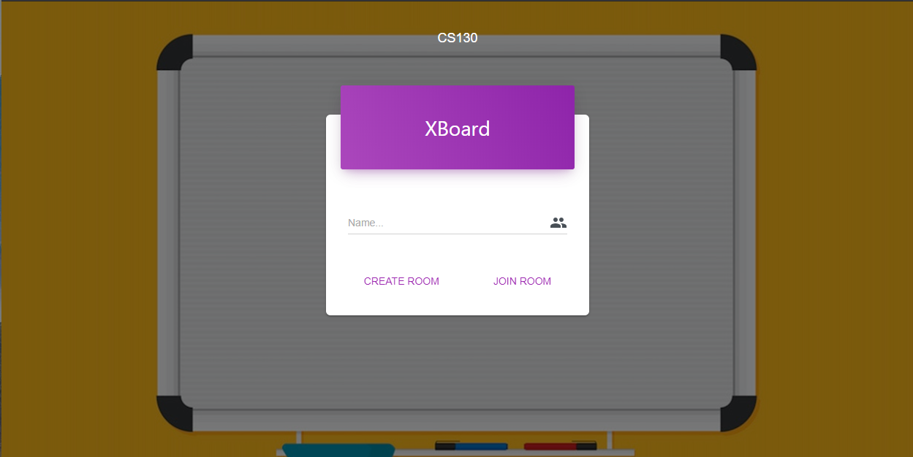

# XBoard
XBoard is a web-based online collaborative “whiteboard” that empowers a group of users to share almost any kind of information under one “whiteboard”. It can be a block of text, a picture, a drawing, a website, or even a video… Every block is draggable and can be located anywhere on the board. XBoard can be used in many different working environments. For example, during the brainstorming phase, users can paste any related information onto the “whiteboard” and make connections among them.

## Directory Structure
Frontend code is located under `src` and `public` 

Backend code is located under `backend` 

Test code is located under `test`

## Installation/Run instructions
### Backend Server

#### Dependencies
First, enter `backend` folder, run `npm install` to install relative dependencies. 

#### Database
You also need a postgres databse. After you install it, please configure the `database` name, database `user`, and `password` under `db_config` under `team-A4/Backend/app.js`. 

#### Start the server
Locate `makefile` under the main directory. In your termianl, type `make server_up`. 

### React App
#### Dependencies
First, under the root folder, run `npm install` to install relative dependencies. 

#### Start the app on localhost
Under the root folder, run `npm start` to start the application. A website will pop-up. 

#### Deploy it to AWS Amplify Console

### Test Code
Under the `test` folder, run `npm install` then `npm test`. It will go through all the test cases. If you want to select a specific test, run `npm test -- --grep "<Test Name>"`. 

## Relevant Links 
- Documentation link
- [Working URL](https://master.d113oqii0ijw7a.amplifyapp.com/)
- [Test Folder](https://github.com/CS130-W20/team-A4/tree/master/test)

